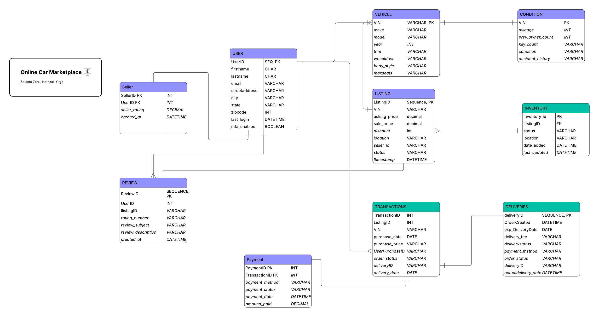

# Online Car Marketplace — Database Design

A relational database design project for an online used-car marketplace, covering schema design, normalization, sample data, and analytical queries.

## Overview

The database models a peer-to-peer automotive marketplace where registered users can act as sellers (posting vehicle listings) and/or buyers (completing purchases). It tracks the full lifecycle of a sale: listing → transaction → payment → delivery, along with post-sale reviews.

## Entity Relationship



Full ERD and formal design documentation are available in the included PDFs:
- `eCommerce Design.pdf` — conceptual design
- `Normalized_ERD.pdf` — normalized ERD
- `Formal Documentation Ecommerce design.pdf` — detailed design writeup

## Schema

| Table | Description |
|---|---|
| `Users` | All registered users; supports MFA |
| `Customer` | Users acting as buyers, with preferred contact method |
| `Seller` | Users acting as sellers, with aggregate rating |
| `Vehicle` | Vehicle catalog keyed by VIN (make, model, year, body style) |
| `ConditionInfo` | Per-vehicle condition details: mileage, owners, accident history |
| `Listing` | A seller's active or past offer for a specific vehicle |
| `Inventory` | Stock status and physical location per listing |
| `Transactions` | Completed purchase records linking a listing to a customer |
| `Payment` | Payment method and status for each transaction |
| `Deliveries` | Delivery address, status, and scheduled date per transaction |
| `Review` | Customer ratings (1–5) and written reviews per listing |

### Key Design Decisions

- **VIN as primary key** on `Vehicle` — globally unique, eliminates surrogate key redundancy
- **Users split into Customer/Seller subtypes** — a single user can hold both roles without duplicating profile data
- **ConditionInfo separated from Vehicle** — keeps the vehicle catalog clean and allows condition to be re-evaluated per listing
- **Inventory decoupled from Listing** — supports future multi-location or multi-unit inventory tracking

## Files

```
eCommerce_design/
├── sql/
│   ├── 01_create_tables.sql   # Schema: DROP/CREATE for all tables
│   ├── 02_insert_data.sql     # Seed data: 10 users, 10 vehicles, 7 transactions
│   └── 03_test_queries.sql    # Sample queries: inventory, sales ranking, purchase history
├── UMLDesign_png.png
├── Normalized_ERD.pdf
├── eCommerce Design.pdf
└── Formal Documentation Ecommerce design.pdf
```

## Seed Data Summary

- **10 users** — 7 customers, 3 sellers (Washington state)
- **10 vehicles** — Honda, Toyota, Tesla, Ford, BMW, Hyundai, Nissan, Jeep
- **10 listings** — mix of Active and Sold
- **7 completed transactions** — via credit card, bank transfer, and cashier's check
- **7 reviews** — ratings 4–5 across sold listings